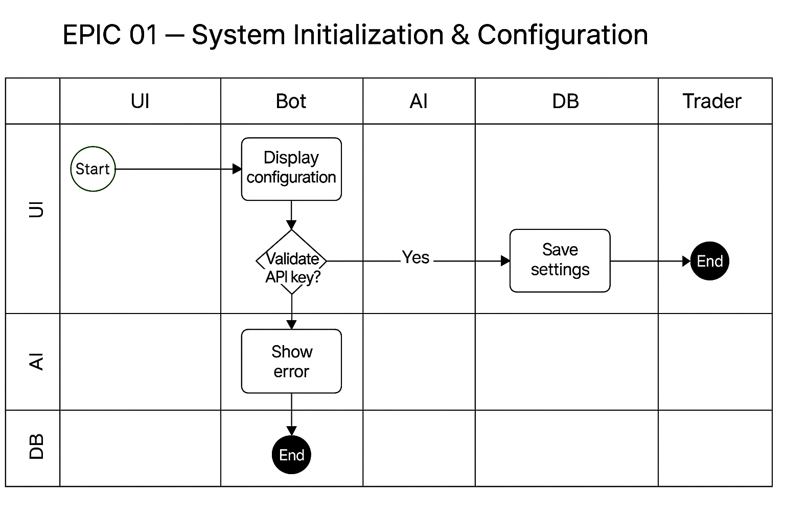

# 📘 Livre de Conception – WatchlistBot V7.03 (Bot IA Unifié pour Trading Haute Volatilité)

## 🧭 Sommaire Structuré

### 🧠 PARTIE 1 – Fondations Stratégiques & Cadrage
- [00. Introduction Générale](00_intro.md)
- [01. Principes du Daily Trading Volatile](01_principes_trading.md)
- [02. Besoins Métier, IA et Objectifs Ciblés](02_besoins.md)
- [03. Approche Agile & Structuration par EPIC](03_agile_structure.md)
- [04. Architecture Technique Unifiée (V7.03)](04_architecture.md)

### 🧩 PARTIE 2 – Modules Fonctionnels (par EPIC)
- [05. Watchlist Import](05_watchlist_import.md)
- [06. Jaguar Scraping](06_jaguar_scraping.md)
- [07. News & Catalyst Detection](07_news_detection.md)
- [08. GPT Scoring Validation](08_gpt_scoring.md)
- [09. Pattern Recognition](09_pattern_recognition.md)
- [10. Hybrid Graph Pattern](10_hybrid_graph_pattern.md)
- [11. Simulation Engine](11_simulation_engine.md)
- [12. Backtest Engine](12_backtest_engine.md)
- [13. AI Learning Engine](13_ai_learning_engine.md)
- [14. Meta IA Config](14_meta_ia_config.md)
- [15. AI Performance Maximizer](15_ai_perf_maximizer.md)
- [16. Execution Logic](16_execution_logic.md)
- [17. Trade Execution](17_trade_execution.md)
- [18. Security Guard & Stop Loss](18_security_stoploss.md)
- [19. Streamlit UI](19_streamlit_ui.md)
- [20. Telegram Notifications](20_telegram_notifications.md)
- [21. UI Project Tracker](21_ui_tracker.md)
- [22. Journalisation des Trades](22_journalisation.md)
- [23. Daily Closure](23_daily_closure.md)
- [24. KPI Tracker](24_kpi_tracker.md)
- [25. Administration Base de Données](25_admin_db.md)

### 🤖 PARTIE 3 – Intelligence Artificielle & Logique Apprenante
- [26. Stratégie de Scoring & Apprentissage IA](26_ia_strategy.md)
- [27. Logs, Journalisation, Feedback Loop IA](27_logs_feedback.md)

### ✅ PARTIE 4 – Suivi, Testing et Roadmap
- [28. Suivi Agile & Plan de Livraison](28_agile_tests.md)
- [29. Roadmap V8+ : Image IA, Auto Trade, Broker API](29_roadmap.md)
- [30. Retour d’Expérience, Transfert & Réplication](30_feedback.md)

### 📎 ANNEXES
- [Modules Python & Mapping](annexes/modules_python.md)
- [Prompts IA Structurés & Commentés](prompts/index.md)
- [Diagrammes BPMN & Schémas Techniques](annexes/diagrams.md)

---

## 📊 Diagramme BPMN

❌ No BPMN diagram available for EPIC 01.

---

## 📊 Diagramme BPMN

---

## 🇬🇧 English Version

This chapter introduces the **System Initialization** of WatchlistBot. It lists
all major EPICs and outlines the steps required to configure the environment
before any trading activity. The table of contents below mirrors the French
version and serves as the starting point for the unified documentation.

### 🧭 Structured Table of Contents

#### 🧠 PART 1 – Strategic Foundations & Framing
- [00. General Introduction](00_intro.md)
- [01. Principles of Daily Volatile Trading](01_principes_trading.md)
- [02. Business Needs, AI and Target Objectives](02_besoins.md)
- [03. Agile Approach & EPIC Structure](03_agile_structure.md)
- [04. Unified Technical Architecture (V7.03)](04_architecture.md)

#### 🧩 PART 2 – Functional Modules (by EPIC)
- [05. Watchlist Import](05_watchlist_import.md)
- [06. Jaguar Scraping](06_jaguar_scraping.md)
- [07. News & Catalyst Detection](07_news_detection.md)
- [08. GPT Scoring Validation](08_gpt_scoring.md)
- [09. Pattern Recognition](09_pattern_recognition.md)
- [10. Hybrid Graph Pattern](10_hybrid_graph_pattern.md)
- [11. Simulation Engine](11_simulation_engine.md)
- [12. Backtest Engine](12_backtest_engine.md)
- [13. AI Learning Engine](13_ai_learning_engine.md)
- [14. Meta AI Config](14_meta_ia_config.md)
- [15. AI Performance Maximizer](15_ai_perf_maximizer.md)
- [16. Execution Logic](16_execution_logic.md)
- [17. Trade Execution](17_trade_execution.md)
- [18. Security Guard & Stop Loss](18_security_stoploss.md)
- [19. Streamlit UI](19_streamlit_ui.md)
- [20. Telegram Notifications](20_telegram_notifications.md)
- [21. UI Project Tracker](21_ui_tracker.md)
- [22. Trade Logging](22_journalisation.md)
- [23. Daily Closure](23_daily_closure.md)
- [24. KPI Tracker](24_kpi_tracker.md)
- [25. Database Administration](25_admin_db.md)

#### 🤖 PART 3 – Artificial Intelligence & Learning Logic
- [26. Scoring Strategy & AI Learning](26_ia_strategy.md)
- [27. Logs, Journaling, IA Feedback Loop](27_logs_feedback.md)

#### ✅ PART 4 – Monitoring, Testing and Roadmap
- [28. Agile Monitoring & Delivery Plan](28_agile_tests.md)
- [29. Roadmap V8+: Image AI, Auto Trade, Broker API](29_roadmap.md)
- [30. Experience Feedback, Transfer & Replication](30_feedback.md)

#### 📎 ANNEXES
- [Python Modules & Mapping](annexes/modules_python.md)
- [Structured & Commented IA Prompts](prompts/index.md)
- [BPMN Diagrams & Technical Schemas](annexes/diagrams.md)

---

## 🔍 Scope Visualization

| In Scope (Initialization)                           | Out of Scope |
| -------------------------------------------------- | ------------ |
| Setting environment variables and `.env` file      | Full broker integration |
| Creating initial SQLite databases                  | Advanced AI training loops |
| Basic logging configuration                        | Production deployment |
| Verifying API key presence                         | User permission management |

