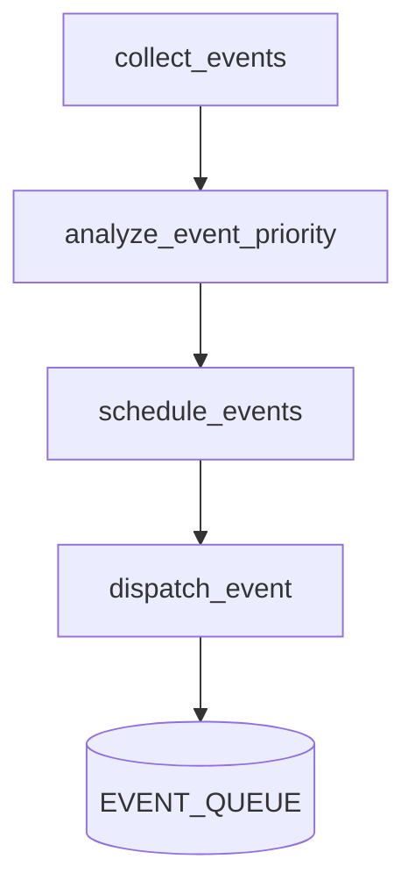

# 🧠 MODULE 1 – Orchestrateur d'Événements `automation/orchestrateur_evenements.py`

## 🎯 Objectif du module
Centraliser la **collecte**, l'**analyse** et la **planification** des événements issus de la base `project_tracker.db` ou d'autres sources (watchlist trading).
Il prépare des objets `Event` enrichis (priorité, horaire optimal, tags de contexte) et les place dans une file prioritaire à destination des prochains modules TTS/STT/IA.

---

## 📁 Fichier principal
- `automation/orchestrateur_evenements.py`

### 📂 Dépendances internes
| Fichier | Rôle |
| --- | --- |
| `utils/db_access.py` | Accès simplifié aux bases SQLite |
| `automation/codex_watcher.py` | Génère des événements depuis les logs (à intégrer) |

---

## 🧱 Fonctions principales

### `collect_events()`
Charge les tâches, user stories et objectifs personnels encore actifs.
Retourne une liste de dictionnaires normalisés.

### `analyze_event_priority(event)`
Calcule une priorité dynamique (`CRITICAL`, `URGENT`, `IMPORTANT`, `INFO`, `BACKGROUND`) selon l'échéance, l'importance et le type d'événement.

### `schedule_events(events)`
Utilise `SmartScheduler` pour déterminer l'heure de traitement optimale et ordonner les événements dans la file `heapq`.

### `dispatch_event(event)`
Ajoute l'événement planifié dans la file globale `EVENT_QUEUE`. Les événements critiques en dehors des heures vocales déclenchent une alerte Telegram immédiate.

---

## 🗺️ Workflow simplifié


---

## 📦 Détail du pipeline

Cette section décrit le cheminement complet d'un événement, depuis la collecte
jusqu'à son éventuelle exécution par le bot.

1. **collect_events** – regroupe les tâches, user stories, objectifs
   personnels et alertes trading depuis les bases SQLite. Chaque entrée est
   convertie en dictionnaire normalisé avec `event_id`, `source` et `title`.
2. **analyze_event_priority** – détermine la priorité dynamique en fonction de
   l'échéance et de l'importance de chaque événement.
3. **schedule_events** – transforme ces dictionnaires en objets `Event` et
   calcule l'heure idéale de traitement via `SmartScheduler` avant de trier la
   liste.
4. **dispatch_event** – insère l'objet planifié dans `EVENT_QUEUE`. Les
   événements `CRITICAL` hors heures vocales envoient une alerte Telegram et les
   tags `trading` activeront `trigger_trading_action` lors du dépilement.

Exemple JSON d'un événement :

```json
{
  "event_id": "trade_AAPL",
  "source": "watchlist",
  "title": "AAPL",
  "priority": "URGENT",
  "time_to_run": "2024-05-20T09:15:00",
  "output_channel": "vocal",
  "context_tags": ["trading"],
  "payload": {"score": 9.5, "change_percent": 12.3}
}
```

Ce pipeline alimente le système de notifications vocales ou Telegram et peut
déclencher des actions de trading lorsque le contexte l'indique.

---

## 🔄 Prochaine étape
- Intégration d'un moteur TTS pour vocaliser les éléments de `EVENT_QUEUE`
- Thread STT pour écouter les réponses utilisateur sans bloquer la planification
- Callbacks ou workers asynchrones pour déclencher des IA externes (GPT‑4, Claude, FinRL)

---

## 🧪 Tests recommandés
- **collect_events**: base vide vs données exemple
- **analyze_event_priority**: scénarios d'urgence, retards, priorité "critical"
- **schedule_events**: vérifie l'ordre chronologique et la prise en compte des heures vocales

Les tests peuvent être ajoutés dans `tests/test_orchestrateur.py`.

---

## 📂 Exécution rapide
```bash
python -m automation.orchestrateur_evenements
```
