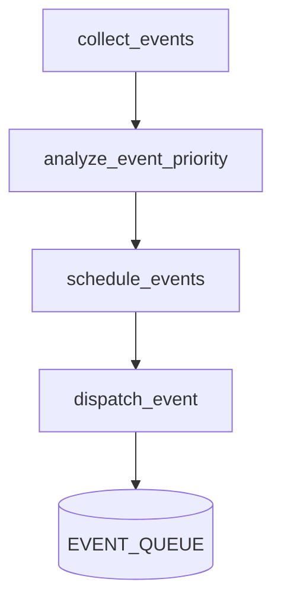

# 🧠 MODULE 1 – Orchestrateur d'Événements `automation/orchestrateur_evenements.py`

## 🎯 Objectif du module
Centraliser la **collecte**, l'**analyse** et la **planification** des événements issus de la base `project_tracker.db` ou d'autres sources (watchlist trading).
Il prépare des objets `Event` enrichis (priorité, horaire optimal, tags de contexte) et les place dans une file prioritaire à destination des prochains modules TTS/STT/IA.

---

## 📁 Fichier principal
- `automation/orchestrateur_evenements.py`

### 📂 Dépendances internes
| Fichier | Rôle |
| --- | --- |
| `utils/db_access.py` | Accès simplifié aux bases SQLite |
| `automation/codex_watcher.py` | Génère des événements depuis les logs (à intégrer) |

---

## 🧱 Fonctions principales

### `collect_events()`
Charge les tâches, user stories et objectifs personnels encore actifs.
Retourne une liste de dictionnaires normalisés.

### `analyze_event_priority(event)`
Calcule une priorité dynamique (`CRITICAL`, `URGENT`, `IMPORTANT`, `INFO`, `BACKGROUND`) selon l'échéance, l'importance et le type d'événement.

### `schedule_events(events)`
Utilise `SmartScheduler` pour déterminer l'heure de traitement optimale et ordonner les événements dans la file `heapq`.

### `dispatch_event(event)`
Ajoute l'événement planifié dans la file globale `EVENT_QUEUE`. Les événements critiques en dehors des heures vocales déclenchent une alerte Telegram immédiate.

---

## 🗺️ Workflow simplifié


---

## 🔄 Prochaine étape
- Intégration d'un moteur TTS pour vocaliser les éléments de `EVENT_QUEUE`
- Thread STT pour écouter les réponses utilisateur sans bloquer la planification
- Callbacks ou workers asynchrones pour déclencher des IA externes (GPT‑4, Claude, FinRL)

---

## 🧪 Tests recommandés
- **collect_events**: base vide vs données exemple
- **analyze_event_priority**: scénarios d'urgence, retards, priorité "critical"
- **schedule_events**: vérifie l'ordre chronologique et la prise en compte des heures vocales

Les tests peuvent être ajoutés dans `tests/test_orchestrateur.py`.

---

## 📂 Exécution rapide
```bash
python -m automation.orchestrateur_evenements
```
