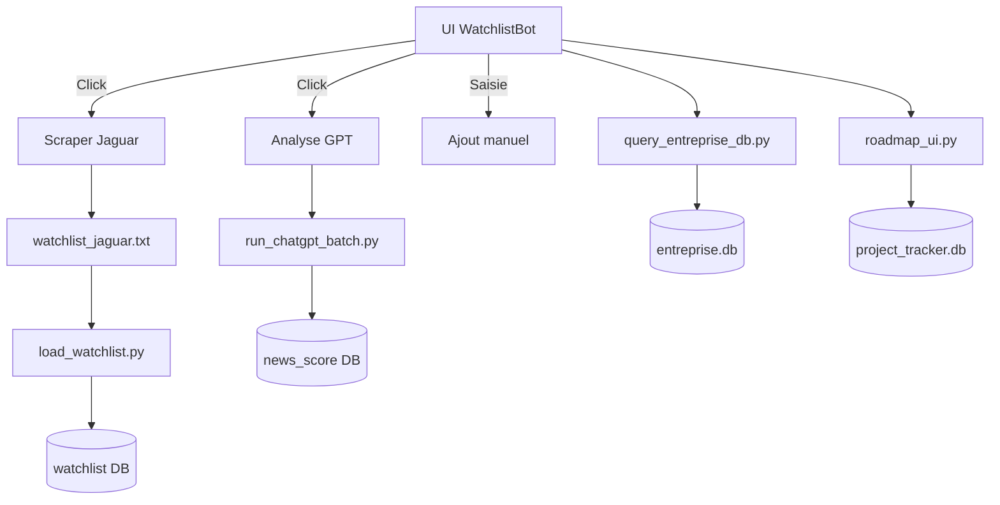

# 📘 MODULE 1 – Interface Principale `app_unifie_watchlistbot.py`

## 🎯 Objectif du module
Interface principale utilisateur du bot WatchlistBot (Version V7+). Ce module centralise :
- L’analyse des tickers par GPT
- L’affichage dynamique de la watchlist avec données Finnhub
- L’injection des données Moomoo (Jaguar)
- La gestion manuelle des tickers
- La navigation vers les blocs Roadmap, Entreprise et Assistant Personnel

---

## 🧱 Architecture technique

### 📁 Fichier principal :
- `ui/app_unifie_watchlistbot.py`

### 📂 Dépendances internes :
| Fichier                               | Rôle principal                                      |
|---------------------------------------|-----------------------------------------------------|
| `scripts/run_chatgpt_batch.py`        | Lance l’analyse GPT et injecte les scores           |
| `scripts/scraper_jaguar.py`           | Scrape les tickers Jaguar depuis Moomoo            |
| `utils/load_watchlist.py`             | Injecte les tickers extraits dans la base          |
| `utils/utils_finnhub.py`              | Récupère prix, float, volume, graphes live         |
| `roadmap_ui.py`                       | Interface de gestion des EPICs / tâches / US       |
| `query_entreprise_db.py`             | Affiche KPI, cas d’usage et modules CRM/IA         |

---

## 🗃 Bases de données utilisées

### `trades.db`
| Table             | Description                                     |
|------------------|-------------------------------------------------|
| `watchlist`       | Liste des tickers à surveiller/analyser        |
| `news_score`      | Résultats des analyses GPT                     |
| `chatgpt_history` | Historique des prompts et réponses ChatGPT     |

### `entreprise.db`
| Table              | Description                                 |
|--------------------|---------------------------------------------|
| `portfolio_modules`| Liste des modules IA/CRM avec catégories    |
| `use_cases`        | Cas d’usage par région et secteur           |
| `revenue_sources`  | Sources de revenu                           |
| `kpi_targets`      | Objectifs chiffrés (KPI)                    |

---

## 🔄 Flux fonctionnels



---

## 🧪 User Stories associées (à compléter)
- #001 Ajouter un ticker manuellement
- #002 Lancer l’analyse GPT d’un lot de tickers
- #003 Scraper les posts Jaguar depuis Moomoo
- #004 Afficher les données dynamiques Finnhub
- #005 Injecter la watchlist Jaguar dans la base
- #006 Naviguer vers Roadmap, Entreprise ou Personnel
- #007 Afficher graphique intraday par ticker

---

## ✅ État du module

- ✅ Tous les fichiers nécessaires reçus
- ✅ Vérification de compatibilité terminée
- ✅ Analyse fonctionnelle complète
- 🟢 Prêt à l'intégration avec modules suivants

---

## 📌 Historique des mises à jour

- **2025-05-21** : Création initiale du document


---

## 🗂 Chemin local de référence (ordinateur utilisateur)

**Répertoire racine local :**
```
Ce PC > Bureau > python > projet AI > BOTV7 > BOTV7
```

**Exemples de chemins complets :**
- `ui/app_unifie_watchlistbot.py`
- `scripts/run_chatgpt_batch.py`
- `scripts/scraper_jaguar.py`
- `utils/utils_finnhub.py`
- `data/trades.db`
- `data/entreprise.db`
- `project_doc/` *(documentation des EPICs, images BPMN, etc.)*
- `VERSION_HISTORY.md` *(journal des versions stable)*

**Règle de synchronisation :**
À chaque étape de validation d’un module, le chemin **exploité dans l’environnement Streamlit** et **le chemin local sur l’ordinateur** doivent correspondre.

Ainsi, toute divergence (ex. : fichier déplacé, renommé ou en double) sera signalée ici dans la section de documentation.

