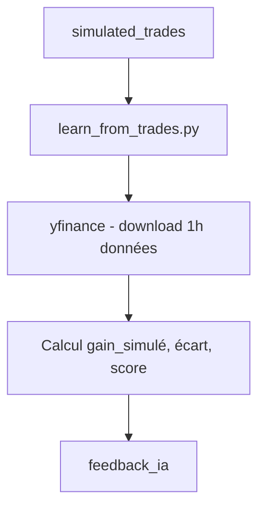

# 🤖 MODULE 2 – Learning Engine : `learn_from_trades.py`

## 🎯 Objectif du module
Ce module permet de :
- Suivre l’évolution réelle d’un trade simulé après son exécution
- Comparer le gain **estimé** et le gain **réel simulé**
- Calculer une **performance IA** sur 10 (plus l’écart est faible, meilleure la prédiction)
- Enrichir une table dédiée `feedback_ia` pour entraîner et affiner les futurs modèles IA

---

## 📂 Fichier principal
- `learn_from_trades.py`

## 🗂 Chemin local utilisateur :
```
C:\Users\KARIM\Desktop\python\projet AI\BOTV7\BOTV7\learn_from_trades.py
```

## 📁 Chemin projet :
```
BOTV7/learn_from_trades.py
```

---

## 🧠 Logique fonctionnelle

1. Connexion à la base `trades.db`
2. Sélection des trades de `simulated_trades` sans feedback
3. Téléchargement des prix réels via `yfinance` sur +1h après exécution
4. Calcul du gain simulé :
```
gain_simule = (close_price - entry_price) * quantity - fees
```
5. Calcul de l’écart :
```
ecart_gain = gain_simule - gain_potentiel
```
6. Score de performance IA (entre 0 et 10) :
```
performance_ia = 10 - abs(ecart_gain / gain_potentiel) * 10
```

7. Insertion dans la table `feedback_ia` :
```sql
CREATE TABLE IF NOT EXISTS feedback_ia (
    id INTEGER PRIMARY KEY AUTOINCREMENT,
    trade_id INTEGER,
    ticker TEXT,
    executed_at TEXT,
    entry_price REAL,
    gain_potentiel REAL,
    gain_simule REAL,
    ecart_gain REAL,
    performance_ia REAL,
    date_feedback TEXT
)
```

---

## 🗃 Tables utilisées dans `trades.db`

| Table              | Rôle                                       |
|-------------------|---------------------------------------------|
| `simulated_trades`| Source des données d’exécution simulée      |
| `feedback_ia`      | Table cible enrichie avec feedback IA       |

---

## 🔄 Flux fonctionnel



---

## ✅ État du module

- ✅ Fichier reçu et analysé
- ✅ Tables détectées et cohérentes
- ✅ Téléchargement YFinance intégré
- 🟢 Prêt à être relié au moteur IA principal ou à un modèle de scoring

---

## 📌 Historique des mises à jour

- **2025-05-21** : Création initiale du document
