# 📘 MODULE 4 – Backtest Engine : `simulate_backtest.py`

## 🎯 Objectif du module
Ce moteur exécute des backtests sur des périodes passées à partir des données historiques. Il simule les trades, calcule les performances, compare les résultats avec les stratégies IA actuelles et fournit un rapport complet pour l'entraînement et l’évaluation.

---

## 📂 Fichier attendu
- `simulate_backtest.py`

### 📁 Chemin projet suggéré :
```
BOTV7/backtest/simulate_backtest.py
```

### 📁 Chemin local utilisateur suggéré :
```
C:\Users\KARIM\Desktop\python\projet AI\BOTV7\BOTV7\backtest\simulate_backtest.py
```

---

## 📋 User Stories associées (Backtest Engine)

| ID                | Rôle         | Description courte                                      | Status |
|-------------------|--------------|----------------------------------------------------------|--------|
| US-BACKTEST-001   | Trader       | Lancer un backtest sur une période historique            | To Do  |
| US-BACKTEST-002   | Bot          | Simuler des trades sur données passées                  | To Do  |
| US-BACKTEST-003   | Système      | Journaliser chaque trade simulé                         | To Do  |
| US-BACKTEST-004   | Trader       | Voir PnL, win rate, statistiques                        | To Do  |
| US-BACKTEST-005   | Bot          | Appliquer pondérations IA                              | To Do  |
| US-BACKTEST-006   | Système      | Comparer à la stratégie réelle                         | To Do  |
| US-BACKTEST-007   | Trader       | Choisir tickers/périodes à tester                      | To Do  |
| US-BACKTEST-008   | Système      | Sauvegarder configuration utilisée                     | To Do  |
| US-BACKTEST-009   | IA           | Analyser résultats pour s’auto-ajuster                 | To Do  |
| US-BACKTEST-010   | Système      | Exporter résultats CSV/JSON                            | To Do  |

---

## 🧠 Flux logique

```mermaid
flowchart TD
    A[Choix tickers + période] --> B[Lancer backtest]
    B --> C[Simuler trades]
    C --> D[Logger dans trades_simules]
    C --> E[Calcul PnL, gain, win rate]
    E --> F[Comparer avec stratégie réelle]
    E --> G[Auto-analyse IA]
    F --> H[Export CSV / dashboard UI]
```



---

## 🗃 Bases attendues

- `trades.db`
  - Table : `simulated_trades` (journal des backtests)
  - Table : `feedback_ia` (comparaison IA vs réel)
- Données historiques : `yfinance` ou fichiers `.csv` / `.json`

---

## 🔁 Liens avec autres modules

- `learn_from_trades.py` → pour l’analyse des résultats simulés
- `journal.py` → pour affichage
- `watchlist.py` → pour sélectionner les tickers

---

## 📌 Statut actuel

- 📄 10 user stories identifiées dans `USER_STORIES_BACKTEST_ENGINE.xlsx`
- ⛔ Code non retrouvé
- 🟠 Module prioritaire à créer pour V8

---

## 📌 Historique des mises à jour

- **2025-05-21** : Fiche générée à partir des user stories validées
